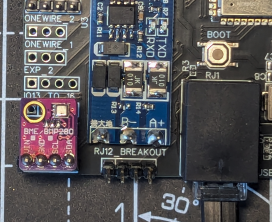

# How to connect sensors to a prebuild PCBs

The prebuild PCBs sold by tynet.eu have four expansion ports ready to be extended with temperature sensors and more.
Adding a sensor is NOT plug & play currently, but still simple to get up and running.

After connecting it you will need to flash the correct Software over OTA Update to make it work.

## The expansion ports

| Name        | Pin 1 | Pin 2 | Pin 3 | Pin 4 |
| ----------- | ------|-------|-------|-------|
| EXP_1       | 3V3 | GND | IO_5 | IO_6       |
| EXP_2       | GND | IO_7 | IO_8 | 3V3       |
| ONEWIRE_1   | GND | IO_4 | 3V3  |           |
| ONEWIRE_2   | GND | IO_40 | 3V3 |           |

Here you can also see the pin layout on the PCB

## Connecting temperature sensors

### DHT22

The DHT sensor uses a onewire connecting, so you can use one of the onewire expansion ports for it.

To make it work you need to flash the correct Software named: **esp32s3_tynet_DHT22**

### BMP280

The BMP280 Sensor is very popular and the EXP_1 port is optimized for it so most variatns you can get are pin compatible.

It can be just connected to the port as is, otherwise you need to connect the pins like the following:

| EXP_1 Pin | BMP280 Pin |
|-----------|------------|
| 3V3 | 3V3 |
| GND | GND |
| IO_5 | SCL |
| IO_6 | SDA |

