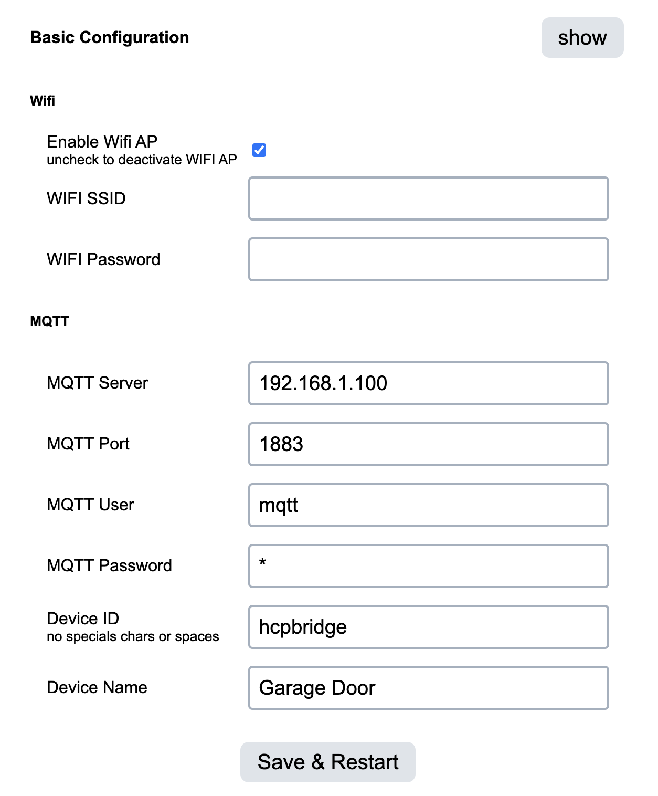

# Getting started with prebuild PCBs

If you bought a prebuild PCB from either Tynet.eu or someone else you can follow this setp by step guide to setup your HCP-Bridge with your Hörmann Garage Door.
These instructions focus on the tynet.eu PCB version, but it will be really similar with all PCBs.

You want to connect temperature sensors or something else? See our guide: [Connecting sensors on tynet boards](connecting_sensors_prebuild_pcbs.md)

## What you need

* Prebuild PCB with HCPBridge Firmware installed (installed out of the box on tynet.eu PCBs)
* USB-C power supply

## Initial configuration

### 1. Connect the PCB to power via the USB-C connector and wait a few seconds. the 3V3 LED will be lit.
### 2. Search and connect to the WIFI Network called "HCPBRIDGE" the PCB creates with a phone or pc.
### 3. When connected, open a webbrowser and go to the WEBUI under the following url : http://192.168.4.1

### 4. Open the "Basic Configuration" tab and enter your WIFI and MQTT credentials, then click save.

Note: The wifi password has to be ASCII chars between ASCII 32-126.

### 5. The PCB should now be connected to your wifi. You can now check if it is reachable from your home network and if it connected to your MQTT Server.

## Installation

### 1. connect the PCB with a RJ12 cable to the BUS port on your Hörmann garage door motor (image below, see green arrow).

   
### 2. Figure out how to execute a bus scan on your model, see info below or have a look in your motors ueer manual.

**ProMatic Serie 4**

Use the bottom dip switch (see image above, blue arrow) and toggle it, this will start the buss can.

**SupraMatic E/P Serie 4**

Use the Buttons to navigate to the menu 37 and excecute the Bus Scan, see here: [Tor7.de - Supramatic Bus Scan](https://www.tor7.de/news/bus-scan-beim-supramatic-serie-4-fehlercode-04-vermeiden)
  
### 3. execute a bus scan on your garage door motor, this should make the PCB light up (3V3) and blink rapidly (RS485 module)
### 4. if the bus scan was succesfully you can connect to the WEBUI and control your garage door motor, it should look like in the image below.

