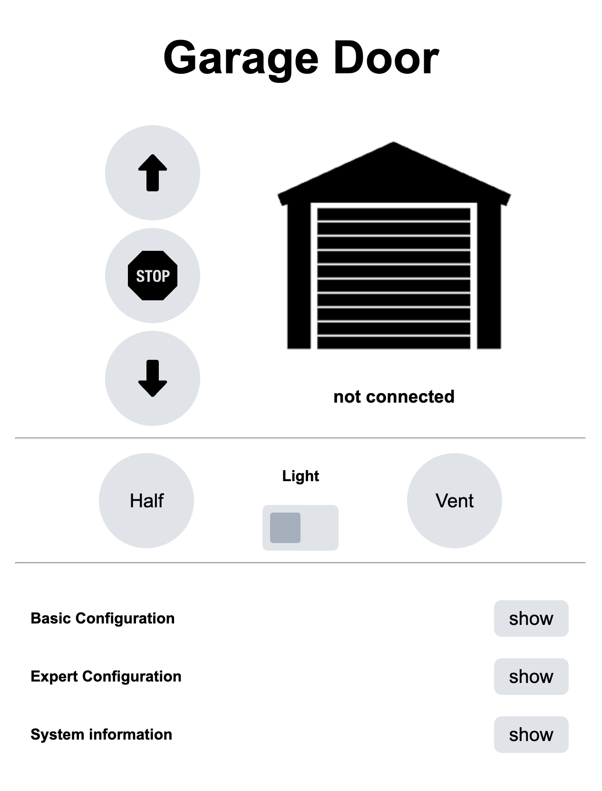

# Getting Started with the Prebuilt PCBs

If you bought a prebuilt PCB from either tynet.eu or someone else you can follow this step by step guide to set up your HCP-Bridge with your Hörmann Garage Door.  

These instructions focus on the tynet.eu PCB version, but it will be really similar with all PCBs.

### Which version of the PCB did you order from tynet.eu?

* [HCPBridge for Series 4](#series-4---preinstalled-firmware-non-esphome)
* [HCPBridge for SupraMatic 3](#supramatic-3---preinstalled-firmware-esphome-based)

You want to connect temperature sensors or something else? See our guide: [Connecting sensors on Tynet boards](connecting_sensors_prebuilt_pcbs)

You want to use the ESPHome-based firmware? See our guide: [Getting started with ESPHome](getting_started_esphome.md)

### What you need

* Prebuilt PCB with HCPBridge Firmware installed (installed out of the box on tynet.eu PCBs)
* USB-C power supply

----

# Series 4 - preinstalled firmware (non-ESPHome)

## Initial configuration

### 1. Connect the PCB to power via the USB-C connector and wait a few seconds. The 3V3 LED will be lit.

### 2. With a phone or a PC, search and connect to the Wi-Fi network called "HCPBRIDGE" created by the PCB.

### 3. When connected, open a web browser and go to the Web UI under the following url: http://192.168.4.1

### 4. Open the "Basic Configuration" tab and enter your Wi-Fi and MQTT credentials, then click save.

> [!NOTE]
> The Wi-Fi password has to be ASCII characters between ASCII 32-126.
> The DeviceID can NOT include any spaces or special chars

> [!TIP]
> To disable the Wi-Fi AP just uncheck the "Enable Wifi AP" checkbox and save

### 5. The PCB should now be connected to your Wi-Fi. You can now check if it is reachable from your home network and if it connected to your MQTT Server.

## Installation

> [!IMPORTANT]
> DON'T connect the USB-C connector to your PC or a PSU while it's connected to the garage door motor with the RJ12 cable!

### 1. connect the PCB with a RJ12 cable to the BUS port on your Hörmann garage door motor (image below, see green arrow).

   
### 2. Figure out how to execute a bus scan on your model, see info below or have a look in your motors user manual.

**ProMatic Serie 4**

Use the bottom dip switch (see image above, blue arrow) and toggle it, this will start the buss can.

**SupraMatic E/P Serie 4**

Use the Buttons to navigate to the menu 37 and execute the Bus Scan, see here: [Tor7.de - SupraMatic Bus Scan](https://www.tor7.de/news/bus-scan-beim-supramatic-serie-4-fehlercode-04-vermeiden)
  
### 3. execute a bus scan on your garage door motor, this should make the PCB light up (3V3) and blink rapidly (RS485 module)
### 4. if the bus scan was successful, you can connect to the Web UI and control your garage door motor, it should look like in the image below.

# SupraMatic 3 - preinstalled firmware (ESPHome based)

PCBs from tynet.eu for the SupraMatic 3 are shipping preinstalled with ESPHome-based firmware that is a bit different.

Please follow our ESPHome instructions from the "Board Setup" step: [Getting started with ESPHome](getting_started_esphome.md#board-setup)

> [!NOTE]
> The default login for the Web UI is `user: admin` and `pass: tynet.eu`

## Installation

> [!IMPORTANT]
> DON'T connect the USB-C connector to your PC or a PSU while it is connected to the garage door motor with the RJ12 cable!

### 1. connect the PCB with a RJ12 cable to the BUS port on your Hörmann garage door motor

### 2. The SupraMatic e3 should power the pcb over RJ12 and all should be working now.

# SupraMatic 4 - ESPHome-based firmware

PCBs from tynet.eu can be used with the Series 4 ESPHome based firmware as well, just follow our instructions on getting started with ESPHome, this also includes flashing instructions if you want to upgrade from the non-ESPHome version.

[Getting started with ESPHome](getting_started_esphome.md)
